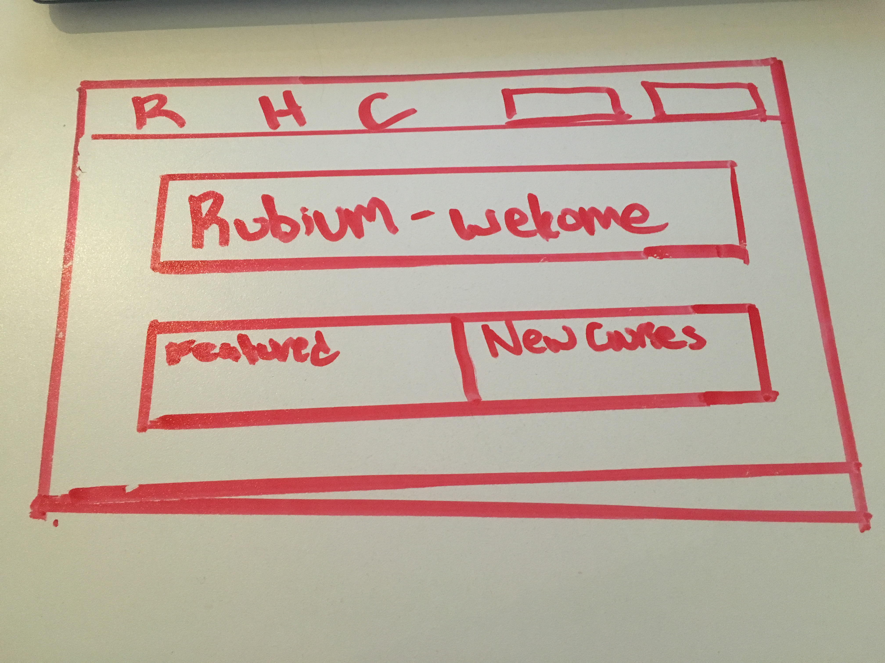
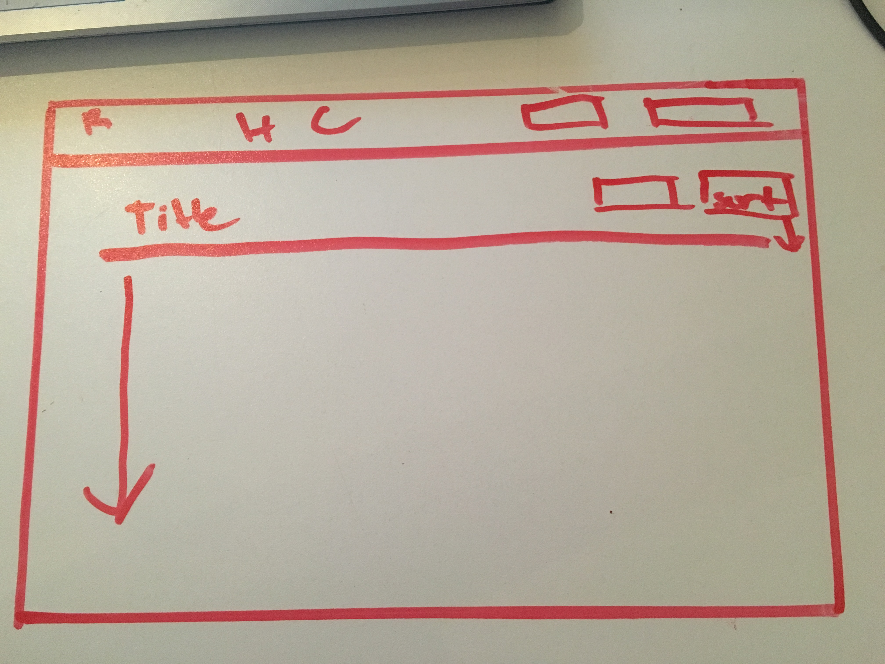

# Skedj

https://skedj.herokuapp.com/

https://trello.com/b/afv84TWz/wdi-p3

### Description

This website simplifies making itineraries by giving you realtime access to Yelp's api giving you a rundown of restaurant, bars, events, etc in your geolocated area. We give you an easy step by step process that lets you plug in what you want to our "sophisticated algorithm", and in return you receive the most ideal schedule combination of business based off of your needs & location.

### Technologies Used

- MongoDB
- Express
- Angular.js
- Node.js
- Bootstrap
- HTML
- CSS
- Jade

### Third-party APIs

- Yelp

### OAuth Providers

- Facebook

### Wireframes

  

 

 
 
 

### Data Model

- User
  - contains user data (email, password, saved schedules[links as reference])
- Schedule
  - contains times and an array of businesses (embeded)
- Business
  - contains reference to a Yelp business id, plus parameters for quick display on frontend
