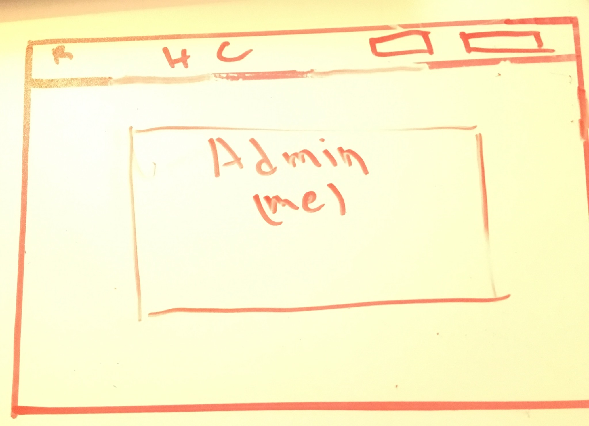
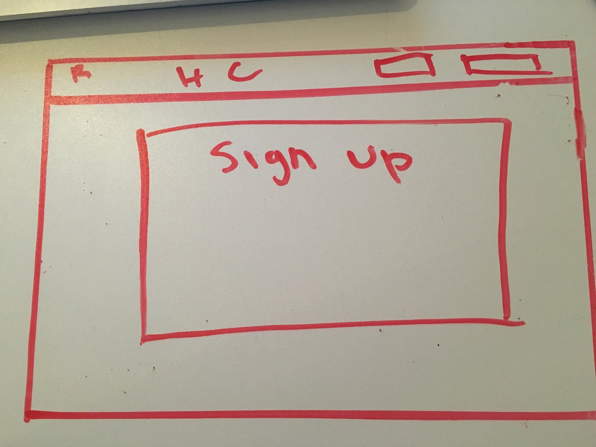

# Rubium

http://rubium1.herokuapp.com/#/

https://trello.com/b/CEETPyw8/rubium

### Description

This website is intended to be a learning platform with an emphasis on security, and free knowledge. The application has a great foundation to add more features do to refactoring. View all available course. Browse by category or tag and find your lesson; lets get learning!

### Technologies Used

- MongoDB
- Express
- Angular.js
- Node.js
- Bootstrap
- HTML
- CSS
- Jade

### Wireframes

  

 

 

 

### Data Model

- User
  - contains user data (email, password)
- Courses
  - contains all default courses
